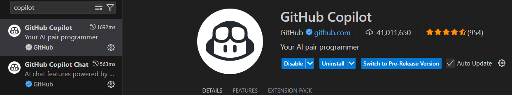
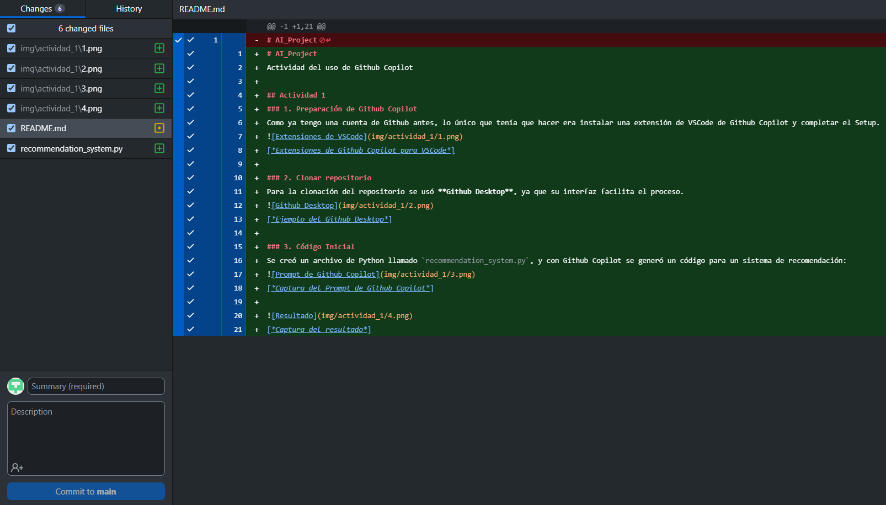
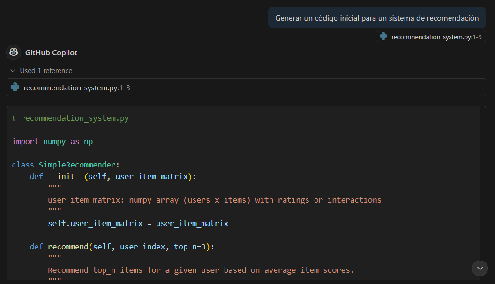
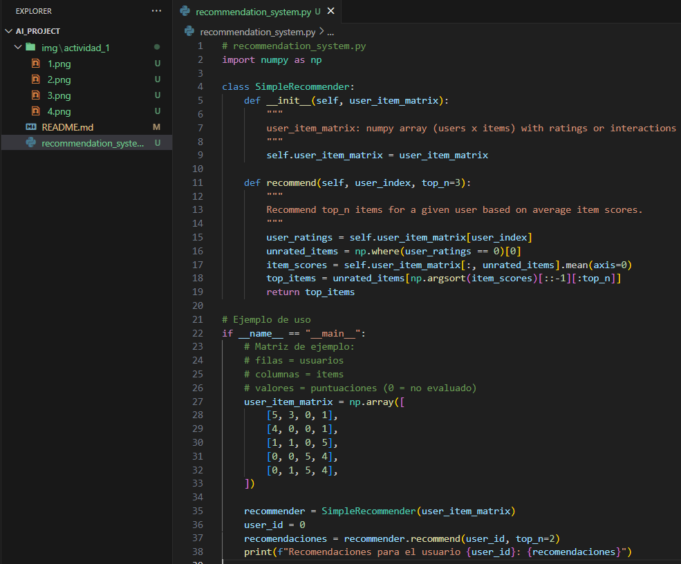

# AI_Project
Actividad del uso de Github Copilot

## Actividad 1
### 1. Preparación de Github Copilot
Como ya tengo una cuenta de Github antes, lo único que tenía que hacer era instalar una extensión de VSCode de Github Copilot y completar el Setup.

[*Extensiones de Github Copilot para VSCode*]

### 2. Clonar repositorio
Para la clonación del repositorio se usó **Github Desktop**, ya que su interfaz facilita el proceso.

[*Ejemplo del Github Desktop*]

### 3. Código Inicial
Se creó un archivo de Python llamado `recommendation_system.py`, y con Github Copilot se generó un código para un sistema de recomendación:

[*Captura del Prompt de Github Copilot*]

[*Captura del resultado*]
